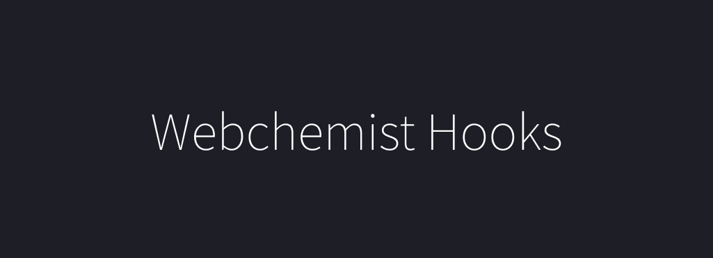

 

  <h1>Webchemist Hooks</h1>

<!-- Badges -->

<!-- ALL-CONTRIBUTORS-BADGE:START - Do not remove or modify this section -->
<!-- ALL-CONTRIBUTORS-BADGE:END -->

 
<pre>npm i @webchemist/hooks</pre>
 

## 📖 Summary

- useQueryString - url의 querystring으로 값을 유지하거나 사용할 수 있습니다.
- useDebounce - 일정한 이벤트(함수)를 지정한 ms에 따라 동작 방지합니다.
- useThrottle - 일정한 이벤트(함수)를 지정한 ms마다 동작합니다.
- useCopyToClipboard - `ref`를 이용하여 `dom`을 선택하고 `onCopy` 함수로 해당 `dom`의 내용을 clipboard로 copy 할 수 있습니다
- useGeolocation - backlog
- useIdel - backlog
- useIncludedInDOM - backlog
- useIncludedInDate - backlog
- useList - backlog
- useMediaQuery - backlog
- useNetworkStatus - backlog
- useNotification - backlog
- useTimer - backlog
- useWindowScroll - backlog
- useOnScreen - backlog
- useScrollPosition - backlog
- useWindowSize - backlog

---

Docs Website - backlog

## 👤 Team Webchemist

[GennYoon](https://portfolio.gennyoon.net)

<!-- HOOKS:START -->

<!-- HOOKS:END -->
